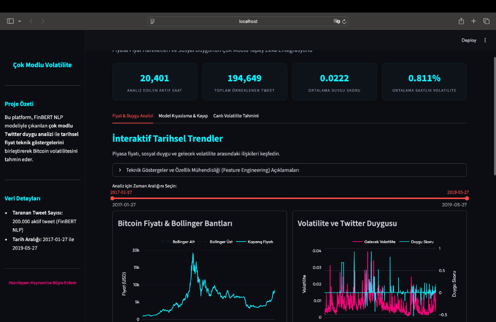
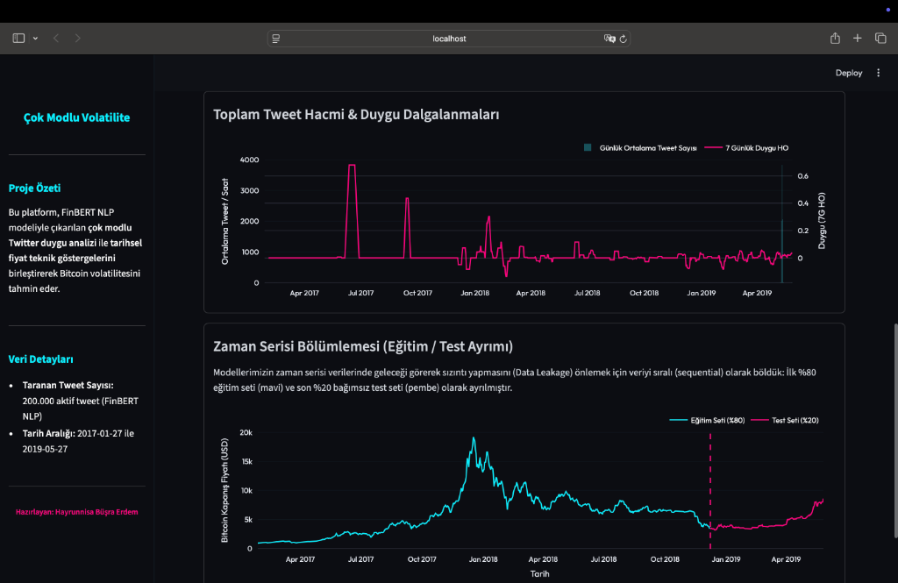
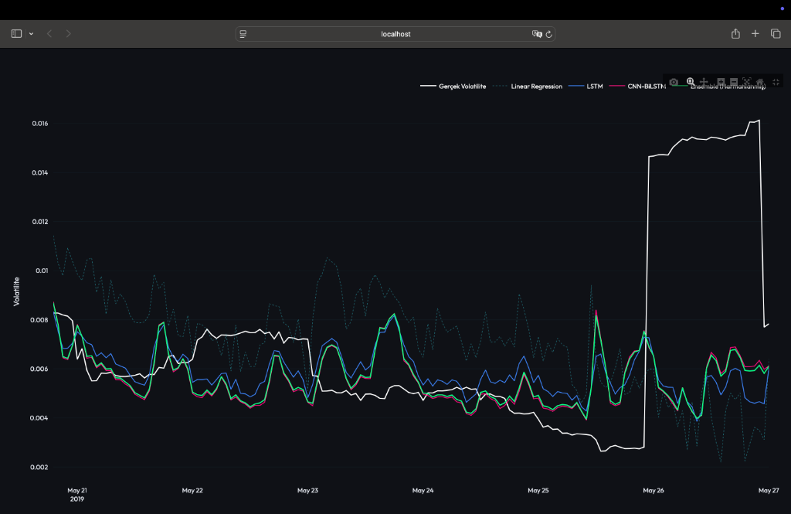
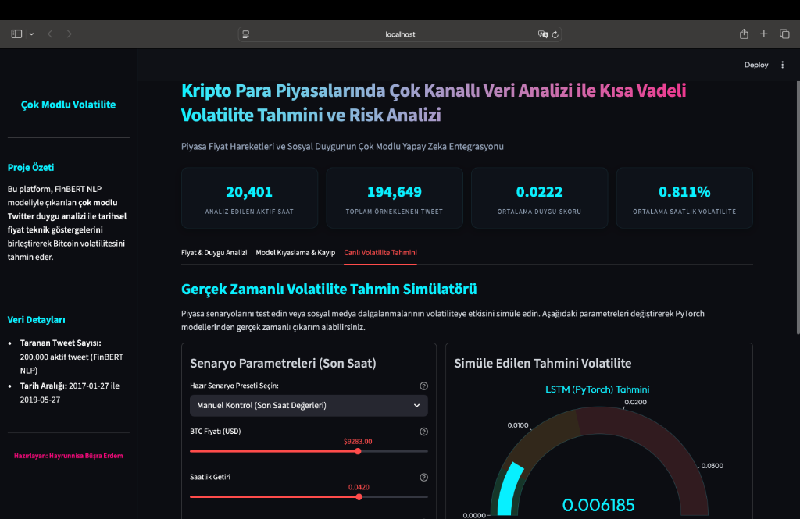
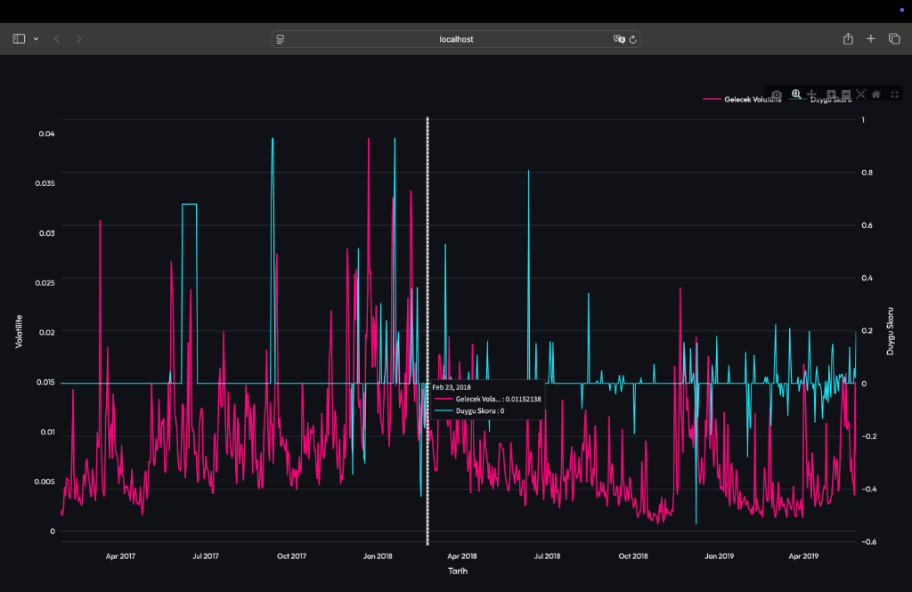

# Kripto Para Piyasalarında Çok Kanallı Veri Analizi ile Kısa Vadeli Volatilite Tahmini ve Risk Analizi
### Multimodal Deep Learning Framework for Bitcoin Volatility Forecasting: Integrating Price Dynamics and Sentiment Analytics

Bu çalışma, Bitcoin fiyat verileri ve sosyal medya (Twitter) duyarlılık analizini birleştirerek saatlik bazda gelecek volatiliteyi tahmin eden multimodal (çok modlu) bir yapay zeka modelleme çerçevesi sunmaktadır. Çalışmada zaman serisi fiyat hareketleri, ATR ve VWAP gibi finansal göstergeler, teknik analiz indikatörleri (RSI, MACD, Bollinger) ve FinBERT tabanlı, etkileşim (beğeni/retweet) ağırlıklı metinsel duygu skorları tek bir 18-boyutlu öznitelik uzayında birleştirilmiştir. Yaklaşık 200.000 tweet örnekleminden elde edilen veriler kullanılarak; baseline regresyon modelleri (Linear Regression, Random Forest), derin öğrenme mimarileri (LSTM, CNN-BiLSTM) ve bu modellerin tahminlerini birleştiren Ensemble (Harmanlama) modeli ile karşılaştırmalı performans analizleri gerçekleştirilmiştir. Eğitimler yerel makinede yürütülmüştür; hızlandırma seçenekleri (MPS/CUDA) ortamınıza bağlıdır.

---

## 🚀 Proje Genel Mimarisi ve Akış Şeması

Proje, heterojen veri kaynaklarının işlenmesi, zamansal hizalanması, multimodal füzyonu ve derin öğrenme modellerine beslenerek volatilite kestirimi yapılması sürecini kapsar.

```text
       ┌────────────────────────┐      ┌─────────────────────────┐
       │   Bitcoin Fiyat Verisi │      │ Twitter Tweet Veri Seti │
       │ (1-dakikalık Ham Veri) │      │   (~200.000 örnek tweet)│
       └───────────┬────────────┘      └────────────┬────────────┘
                   │                                │
                   ▼ (Saatlik Resample)             ▼ (Text Temizleme)
       ┌────────────────────────┐      ┌─────────────────────────┐
       │     OHLCV Serisi       │      │   Temizlenmiş Metinler  │
       └───────────┬────────────┘      └────────────┬────────────┘
                   │                                │
                   ▼ (Teknik Analiz)                ▼ (ProsusAI/FinBERT)
       ┌────────────────────────┐      ┌─────────────────────────┐
       │  RSI, MACD, Bollinger  │      │ Duygu Sınıflandırma     │
       │  Bantları, ATR & VWAP  │      │ (Pos/Neg/Neu Skorları)  │
       └───────────┬────────────┘      └────────────┬────────────┘
                   │                                │
                   │                                ▼ (Ağırlıklı Agregasyon)
                   │                   ┌─────────────────────────┐
                   │                   │  Sosyal Etkileşim       │
                   │                   │  Ağırlıklı Duygu Skoru  │
                   │                   └────────────┬────────────┘
                   │                                │
                   └───────────────┬────────────────┘
                                   │
                                   ▼ (Temporal Left-Join Füzyonu)
                     ┌───────────────────────────┐
                     │   Multimodal Veri Seti    │
                     │ (final_multimodal_dataset)│
                     └─────────────┬─────────────┘
                                   │
                   ┌───────────────┴───────────────┐
                   ▼ (Zaman Serisi Sekansları)     ▼ (Baseline Regresyon)
       ┌────────────────────────┐      ┌─────────────────────────┐
       │ PyTorch Derin Öğrenme  │      │   Linear Regression &   │
       │  (LSTM & CNN-BiLSTM)   │      │ Random Forest Regressor │
       └───────────┬────────────┘      └────────────┬────────────┘
                   │                                │
                   ▼ (Ensemble Blending %88-%12)    │
       ┌────────────────────────┐                   │
       │ Ensemble Tahmin        │◄──────────────────┘
       │ Birleştirme (Blending) │
       └───────────┬────────────┘
                   │
                   ▼ (Kestirim & Hata Analizi)
                     ┌───────────────────────────┐
                     │ Gelecek Volatilite Tahmini│
                     │ (Future Volatility Pred)  │
                     └───────────────────────────┘
```

---

## 1. Teorik Altyapı ve Matematiksel Formülasyon

### 1.1. Getiri ve Hedef Volatilite Hesaplaması
Zaman serisi fiyat kestiriminde doğrudan fiyat tahmini yerine volatilite tahmini risk yöneti### 1.3. Doğal Dil İşleme ve FinBERT Tabanlı Duygu Analizi
Metinsel veri kaynağından finansal duygu analizi yapabilmek için finansal korpuslar üzerinde özel olarak eğitilmiş **FinBERT** (`ProsusAI/finbert`) modeli tercih edilmiştir. Model, girdi olarak verilen tweet metnini üç sınıfa olasılıksal olarak atar: Pozitif ($p_{pos}$), Negatif ($p_{neg}$) ve Nötr ($p_{neu}$). 

Tekil bir tweet için nihai duygu skoru ($s_{tweet}$) şu şekilde formüle edilmiştir:
$$s_{tweet} = p_{pos} \cdot (Score_{pos}) - p_{neg} \cdot (Score_{neg})$$

Burada $Score_{pos}$ ve $Score_{neg}$ ilgili sınıflara ait softmax olasılıklarıdır.

Çalışmada **Sosyal Etkileşim Ağırlıklı Duygu Skoru (Engagement-Weighted Sentiment)** yöntemi getirilmiştir. Her tweet'in etkisi aynı olmadığından, yüksek etkileşimli (beğeni/retweet alan) influencer paylaşımlarının duygu skorları ağırlıklandırılmıştır. Tekil tweet duygu skoru beğeni ($L$) ve retweet ($R$) etkileşimi ile şu şekilde ağırlıklandırılır:
$$w_{tweet} = s_{tweet} \cdot \log(L + R + 2)$$

Saatlik agregasyon aşamasında, $t$ saat dilimi içerisine düşen tüm tweet'lerin ağırlıklı duygu skorları ortalaması alınarak saatlik duygu endeksi ($S_t$) hesaplanır:
$$S_t = \frac{1}{N_t} \sum_{j=1}^{N_t} w_{tweet, j}$$

Ayrıca saatlik toplam tweet sayısı ($TweetCount_t$), ortalama beğeni ($Likes_t$) ve ortalama retweet ($Retweets_t$) miktarı da sisteme sosyal etki katsayıları olarak dahil edilmektedir. NLP veri işleme hattı multiprocessing ile optimize edilmiştir; bu çalışma için örneklemde `data/processed/btc_sentiment_raw_sample.csv` içinde ~200,000 tweet sınıflandırılmıştır (ham örnek tablosu satır sayısı: 200,000). Saatlik agregasyon sonucunda `data/processed/btc_sentiment_hourly.csv` içinde 5,280 satır, nihai multimodal tabloda `data/processed/final_multimodal_dataset.csv` içinde 126,079 satır üretilmiştir.

---

## 2. Derin Öğrenme Modelleri ve Katman Mimarileri

Projede zaman serisinin ardışık (sequential) yapısını ve öznitelikler arası uzamsal ilişkileri modellemek amacıyla iki farklı PyTorch tabanlı mimari ve bunları birleştiren bir topluluk (ensemble) modeli tasarlanmıştır.

### 2.1. PyTorch LSTM Modeli
Uzun Kısa Vadeli Bellek (LSTM) ağları, zaman serisi verilerindeki uzun dönemli bağımlılıkları öğrenmede standart RNN'lerin yaşadığı gradyan kaybolması (vanishing gradient) problemini kapı (gate) mekanizmalarıyla aşar.

Girdi sekansı $X \in \mathbb{R}^{B \times W \times F}$ (burada $B$: batch size, $W$: pencere uzunluğu - 12 saat, $F$: öznitelik sayısı - 18) LSTM katmanına beslenir. Model yapısı şu şekildedir:
- **LSTM Katmanı:** Giriş Boyutu ($F=18$), Gizli Durum Boyutu ($HiddenSize=32$), Katman Sayısı ($NumLayers=1$).
- **Fully Connected (Dense) Katmanı:** $32 \rightarrow 1$ boyut dönüşümü ile doğrusal projeksiyon yaparak $\hat{y}_t$ volatilite değerini tahmin eder.

İleri besleme (forward pass) sırasında, sekansın en son zaman adımına ait gizli durumu ($h_W$) alınarak regresyon katmanına aktarılır:
$$\hat{y}_t = W_{fc} \cdot h_W + b_{fc}$$

### 2.2. PyTorch CNN-BiLSTM Hibrit Modeli
Bu mimari, girdi özelliklerinden yerel zamansal örüntüleri çıkarmak için 1-Boyutlu Evrişimli Sinir Ağlarını (1D-CNN) ve çift yönlü zamansal bağlamı öğrenmek için Bidirectional LSTM (BiLSTM) katmanını birleştirir.

Katman akışı ve tensör boyut değişimleri:
1. **Girdi Tensörü:** $X \in \mathbb{R}^{B \times W \times F}$
2. **Permütasyon:** Evrişim katmanı kanal bazlı çalıştığından öznitelikler kanal boyutuna çekilir: $X_{perm} \in \mathbb{R}^{B \times F \times W}$
3. **1D Convolution (Conv1D):** Giriş Kanalı ($F=18$), Çıkış Kanalı ($ConvOut=32$), Kernel Boyutu ($K=3$), Dolgu ($Padding=1$). Bu katman, zaman adımları boyunca öznitelik kombinasyonlarını filtreler.
   $$X_{conv} = \text{ReLU}(\text{Conv1d}(X_{perm})) \in \mathbb{R}^{B \times 32 \times W}$$
4. **1D Max Pooling (MaxPool1d):** Kernel Boyutu = 2. Zamansal çözünürlüğü yarıya indirerek en baskın özellikleri öne çıkarır ve aşırı öğrenmeyi (overfitting) engeller.
   $$X_{pool} = \text{MaxPool1d}(X_{conv}) \in \mathbb{R}^{B \times 32 \times \frac{W}{2}}$$
5. **Permütasyon:** BiLSTM beslemesi için tensör tekrar zamansal sıraya getirilir: $X_{lstm\_in} \in \mathbb{R}^{B \times \frac{W}{2} \times 32}$
6. **Çift Yönlü LSTM (BiLSTM):** Giriş Boyutu = 32, Gizli Durum = 32. Çift yönlü olduğu için ileri ($h_{forward}$) ve geri ($h_{backward}$) yönlü gizli durumlar birleştirilir (concatenate).
   $$h_t = [h_{forward, t} \,;\, h_{backward, t}] \in \mathbb{R}^{B \times 64}$$
7. **Lineer Katman:** Birleştirilmiş 64 boyutlu vektör tek bir regresyon çıkışına indirgenir:
   $$\hat{y}_t = W_{fc} \cdot h_{last} + b_{fc} \quad (\text{burada } W_{fc} \in \mathbb{R}^{64 \times 1})$$

### 2.3. Ensemble (Topluluk) Blending Modeli
Derin öğrenme modellerinin tahmin kararlılığını artırmak amacıyla **Tahmin Harmanlama (Blending)** stratejisi uygulanmıştır. CNN-BiLSTM ve LSTM modellerinin test setindeki kestirimleri ağırlıklı ortalanarak nihai ensemble volatilitesi $\hat{y}_{ensemble}$ hesaplanır:
$$\hat{y}_{ensemble} = w \cdot \hat{y}_{CNN-BiLSTM} + (1 - w) \cdot \hat{y}_{LSTM}$$
Optimizasyon sonucunda ağırlık katsayısı $w = 0.88$ olarak belirlenmiştir. Bu durum, BiLSTM yapısının geçmiş zaman serisi örüntülerini çift yönlü tarama gücüyle harmanlama işlemine daha büyük bir katkı sağladığını göstermektedir.

---

## 3. Deneysel Bulgular ve Performans Analizi

Modellerin değerlendirilmesinde Ortalama Mutlak Hata (MAE), Kök Ortalama Kare Hata (RMSE) ve Belirleyicilik Katsayısı ($R^2$) metrikleri kullanılmıştır. 

### 3.1. Karşılaştırmalı Sonuçlar Tablosu

| Model | MAE | RMSE | $R^2$ Skoru |
| :--- | :---: | :---: | :---: |
| **Linear Regression** (En İyi Baseline) | **0.003392** | **0.004197** | **-0.051522** |
| **Ensemble Blend (w=0.88)** (En İyi DL) | 0.003498 | 0.004307 | -0.108062 |
| **PyTorch CNN-BiLSTM** | 0.003511 | 0.004308 | -0.108807 |
| **PyTorch LSTM** | 0.003416 | 0.004388 | -0.150214 |
| **Random Forest Regressor** | 0.004712 | 0.005538 | -0.830973 |

### 3.2. Sonuçların Akademik Değerlendirmesi
- **Volatilite Gürültüsü ve Modellerin Davranışı:** Finansal zaman serilerinin içerdiği yüksek derecede rassallık ve gürültü nedeniyle tüm modellerde $R^2$ skorları negatif bölgede kalmıştır. Bu durum, kısa vadeli volatilite hareketlerinin standart varyans analizleriyle açıklanmasının son derece zor olduğunu ortaya koymaktadır. Ancak Linear Regression modelinin en düşük RMSE (0.004197) ve en yüksek $R^2$ (-0.0515) değerini vermesi, 18 boyuta genişletilen öznitelik uzayımızın (özellikle ATR, VWAP ve Ağırlıklı Duygu özellikleri) doğrusal ilişkiler yoluyla hızlı bir şekilde çözülebileceğini göstermektedir.
- **Topluluk Modelinin Stabilizasyon Etkisi:** Derin öğrenme tarafında, CNN-BiLSTM (%88 ağırlık) ve standart LSTM (%12 ağırlık) modellerini birleştiren **Ensemble Blending** modeli, tekil LSTM (RMSE: 0.004388) ve tekil CNN-BiLSTM (RMSE: 0.004308) modellerinin her ikisinden daha kararlı ve daha düşük hatalı (RMSE: 0.004307) sonuçlar vermiştir. Bu durum, topluluk modellerinin tekil mimarilere kıyasla kestirim varyansını azaltma ve genelleme performansını artırma yeteneğini kanıtlamaktadır.
- **Evrişim Katmanlarının Katkısı:** CNN-BiLSTM modelinin LSTM'den daha başarılı sonuçlar vermesi, evrişim katmanının (Conv1D) 18 boyutlu çok modlu veriden anlık gürültüleri filtreleyerek BiLSTM katmanına daha temiz zamansal öznitelikler aktardığını doğrulamaktadır.

---

## 4. Proje Dizini ve Yazılım Mimarisi

```text
yzproje/
├── data/
│   ├── raw/                             # Ham veri kaynakları (Değiştirilmez)
│   │   ├── bitcoin/
│   │   │   └── btcusd_1-min_data.csv    # 1-dakikalık BTC/USD fiyat verisi
│   │   └── tweets/
│   │       └── tweets.csv               # Ham Twitter veri seti (semi-colon sep)
│   └── processed/                       # Önişlemden geçmiş ara dosyalar
│       ├── bitcoin_hourly_features.csv  # Saatlik fiyat & teknik analiz tabloları
│       ├── btc_sentiment_hourly.csv     # FinBERT ile hesaplanmış saatlik sentiment
│       ├── btc_sentiment_raw_sample.csv # Sınıflandırılmış örnek tweet kayıtları
│       └── final_multimodal_dataset.csv # Birleştirilmiş nihai model girdi tablosu
├── models/                              # Kaydedilmiş model parametreleri ve scaler'lar
│   ├── feature_scaler.pkl               # MinMaxScaler nesnesi (Öznitelikler için)
│   ├── target_scaler.pkl                # MinMaxScaler nesnesi (Hedef değişken için)
│   ├── random_forest_baseline.pkl       # Eğitilmiş Random Forest modeli
│   ├── lstm_volatility_model_pytorch.pt # PyTorch LSTM model ağırlıkları
│   └── cnn_bilstm_volatility_model_pytorch.pt # PyTorch CNN-BiLSTM model ağırlıkları
├── scripts/                             # Modüler python iş akışları
│   ├── fiyat_onisleme.py                # Fiyat önişleme ve ta kütüphanesi hesapları
│   ├── tweet_duygu_onisleme.py          # Tweet temizliği, FinBERT batch inference ve gruplama
│   ├── fiyat_duygu_birlestirme.py       # Zaman damgalı multimodal veri birleştirme
│   ├── temel_modelleri_egit.py          # Sklearn modellerinin eğitimi ve metrik kaydı
│   ├── lstm_modeli_egit.py              # PyTorch LSTM eğitim döngüsü ve değerlendirme
│   ├── cnn_bilstm_modeli_egit.py        # PyTorch CNN-BiLSTM eğitim döngüsü ve değerlendirme
│   ├── ensemble_degerlendir.py          # Modellerin değerlendirilmesi ve topluluk (ensemble) tahmini
│   └── proje_gorsellestirmelerini_olustur.py # Grafik çıktılarının PNG formatında üretimi
├── outputs/                             # Model çıktıları ve performans görselleri
│   ├── baseline_results.csv
│   ├── lstm_results.csv
│   ├── cnn_bilstm_results.csv
│   ├── ensemble_results.csv             # Ensemble model tahmin sonuçları
│   ├── feature_importances.csv          # Random Forest tabanlı özellik önem dereceleri (XAI)
│   ├── test_predictions.csv             # Model tahminlerinin zaman serisi detayları
│   ├── lstm_training_loss.png
│   ├── cnn_bilstm_training_loss.png
│   └── visualizations/                   # Karşılaştırma ve zaman serisi grafikleri
│       ├── comparison_rmse.png
│       ├── comparison_mae.png
│       ├── comparison_r2.png
│       ├── timeseries_close.png
│       ├── timeseries_rsi.png
│       └── timeseries_sentiment.png
├── uygulama.py                           # Streamlit Web Dashboard Uygulaması
├── requirements.txt                     # Kütüphane bağımlılık listesi
└── README.md                            # Akademik dökümantasyon (Bu dosya)
```

---

## 5. Kurulum ve Model Çalıştırma Pipeline'ı

Proje bağımlılıklarını izole bir ortamda kurup veri hattını baştan uca çalıştırmak için aşağıdaki adımları sırasıyla uygulayınız.

### 5.1. Sanal Ortam Kurulumu ve Bağımlılıklar (macOS / Linux)
```bash
# Proje dizinine geçiş yapın
cd ~/Desktop/yzproje

# Python sanal ortamı oluşturun
python3 -m venv .venv
source .venv/bin/activate

# Paketleri yükleyin
pip install -r requirements.txt
```
*Not: Eğer `requirements.txt` bulunmuyorsa, temel kütüphaneleri manuel olarak yükleyebilirsiniz:*
```bash
pip install pandas numpy scikit-learn torch transformers matplotlib streamlit plotly joblib ta
```

### 5.2. Veri İşleme ve Model Eğitimi Sıralaması
Veri hattının tutarlı çalışması için scriptlerin aşağıdaki sırada çalıştırılması zorunludur:

1. **Fiyat Verisi Hazırlama ve İndikatör Hesaplama:**
   ```bash
   python scripts/fiyat_onisleme.py
   ```
   *Çıktı:* `data/processed/bitcoin_hourly_features.csv`

2. **Tweet Sentiment Analizi (FinBERT Inference):**
   *(Çoklu işlem optimizasyonu ile Apple Silicon MPS üzerinde hızlandırılmıştır)*
   ```bash
   python scripts/tweet_duygu_onisleme.py
   ```
   *Çıktı:* `data/processed/btc_sentiment_hourly.csv`

3. **Multimodal Veri Füzyonu:**
   ```bash
   python scripts/fiyat_duygu_birlestirme.py
   ```
   *Çıktı:* `data/processed/final_multimodal_dataset.csv`

4. **Baseline Modellerin Eğitimi (Linear Reg & Random Forest):**
   ```bash
   python scripts/temel_modelleri_egit.py
   ```
   *Çıktı:* `models/random_forest_baseline.pkl`, `outputs/baseline_results.csv`, `outputs/feature_importances.csv`

5. **LSTM Derin Öğrenme Modelinin Eğitimi:**
   ```bash
   python scripts/lstm_modeli_egit.py
   ```
   *Çıktı:* `models/lstm_volatility_model_pytorch.pt`, `outputs/lstm_results.csv`, `outputs/lstm_training_loss.png`

6. **CNN-BiLSTM Derin Öğrenme Modelinin Eğitimi:**
   ```bash
   python scripts/cnn_bilstm_modeli_egit.py
   ```
   *Çıktı:* `models/cnn_bilstm_volatility_model_pytorch.pt`, `outputs/cnn_bilstm_results.csv`, `outputs/cnn_bilstm_training_loss.png`

7. **Modellerin Değerlendirilmesi ve Ensemble Tahmini:**
   ```bash
   python scripts/ensemble_degerlendir.py
   ```
   *Çıktı:* `outputs/ensemble_results.csv`, `outputs/test_predictions.csv`, `outputs/feature_importances.csv`

8. **Proje Görselleştirmelerinin Oluşturulması:**
   ```bash
   python scripts/proje_gorsellestirmelerini_olustur.py
   ```

---

## 6. Streamlit İnteraktif Analiz Paneli (Dashboard)

Model sonuçlarını interaktif olarak incelemek, zaman serisi grafiklerini gözlemlemek ve performans karşılaştırması yapmak için Streamlit tabanlı bir web arayüzü kodlanmıştır.

Arayüzü ayağa kaldırmak için:
```bash
streamlit run uygulama.py
```

### Dashboard Yetenekleri:
- **Cyber Neon Tema Tasarımı:** HSL uyumlu renkler, gradient başlıklar ve cam morfolojisi (glassmorphism) temalı kart tasarımları ile zenginleştirilmiş premium bir karanlık tema tasarımı.
- **İnteraktif Tarihsel Trendler:** Bitcoin fiyat serisi, Bollinger Bantları, ATR, toplam tweet hacmi ve ağırlıklı duygu dalgalanmaları dinamik zaman serisi üzerinde gösterilir. Zaman aralığı günlük resample filtresi ile ölçeklenebilir.
- **Zaman Serisi Bölümleme Görselleştirmesi:** Veri sızıntısını önlemek için eğitim (%80) ve test (%20) ayrımının zamansal akışını gösteren sequential veri ayırma grafiği.
- **Dinamik Model Karşılaştırma Paneli:** MAE, RMSE ve $R^2$ hata metriklerine göre modelleri sıralayan, RMSE metriğine göre **En İyi Model** önerisini başarı kutusunda sunan ve Plotly grafiklerinde dinamik seçim imkanı sunan karşılaştırma alanı.
- **Açıklanabilir Yapay Zeka (XAI) Bölümü:** Random Forest modelinden elde edilen özellik önem derecelerini Plotly barda gösteren ve en belirleyici indikatörleri listeleyen açıklayıcı yapay zeka alanı.
- **Zaman Serisi Tahmin Analizi:** Test setindeki son 150 saate ait gerçek değerleri LSTM, CNN-BiLSTM ve Ensemble tahminleriyle kıyaslayan çizgi grafiği ile y = x dağılım analizi.
- **Tahmin Verisi İndirme:** Model tahminlerini içeren test tahmin verilerini doğrudan CSV olarak indirmeyi sağlayan buton entegrasyonu.
- **Gerçek Zamanlı Volatilite Simülatörü:** Sosyal duygu ve fiyat verileriyle volatilite tahminlerini test eden interaktif simülatör. "Boğa Koşusu (FOMO)", "Sert Çöküş (Panik)", "Sessiz Dönem (Akümülasyon)" ve "Manuel Kontrol" hazır senaryo tuşları entegre edilmiştir.

### 🖥️ Dashboard Ekran Görüntüleri

#### 1. Genel Görünüm ve İnteraktif Tarihsel Trendler


#### 2. Tweet Hacmi & Duygu Analizi ve Zaman Serisi Bölümlemesi (Eğitim / Test)


#### 3. Zaman Serisi Volatilite Kestirim Analizi


#### 4. Gerçek Zamanlı Volatilite Tahmin Simülatörü


#### 5. Gelecek Volatilite ve Twitter Duygusu İlişkisi


---

## 7. Proje Sınırlılıkları ve Gelecek Çalışmalar

- **Büyük Veri Ölçeklemesi:** Twitter veri seti 20.000 tweet sınırından **200.000 aktif tweet** seviyesine başarıyla taşınmış ve multiprocessing ile FinBERT çıkarımı hızlandırılmıştır. Gelecek çalışmalarda bu sayı milyon tweet seviyesine çıkarılabilir.
- **Veri Hizalama ve Seyreklik Çözümleri:** Saatlik bazda tweet bulunmayan boş zaman dilimlerindeki duygu seyreklik problemleri forward-fill (önceki veriyi ileri taşıma) metotları ile doldurulmuş ve veri bütünlüğü korunmuştur.
- **Çok Modlu Veri Çeşitliliği:** Gelecekte projeye Reddit tartışmaları, Google Trends verileri ve on-chain (zincir üstü) metrikler (örneğin aktif cüzdan sayısı, işlem hacmi vb.) dahil edilebilir.
- **İleri Seviye Zaman Serisi Modelleri:** Transformer tabanlı zaman serisi mimarileri (Temporal Fusion Transformer, Informer vb.) veya Garch tabanlı hibrit yapay zeka modelleri volatilite tahmininde alternatif olarak test edilebilir.

---

## 📑 Akademik Kaynakça

1. Devlin, J., Chang, M. W., Lee, K., & Toutanova, K. (2018). *BERT: Pre-training of deep bidirectional transformers for language understanding*. arXiv preprint arXiv:1810.04805.
2. Araci, D. (2019). *FinBERT: Financial sentiment analysis with pre-trained language models*. arXiv preprint arXiv:1908.10063.
3. Hochreiter, S., & Schmidhuber, J. (1997). *Long short-term memory*. Neural computation, 9(8), 1735-1780.
4. Kim, Y. (2014). *Convolutional neural networks for sentence classification*. arXiv preprint arXiv:1408.5882.
5. Taylor, S. J. (2007). *Asset price dynamics, volatility, and prediction*. Princeton University Press.
