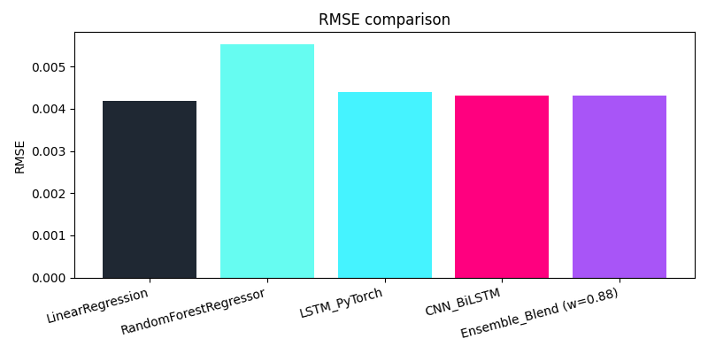
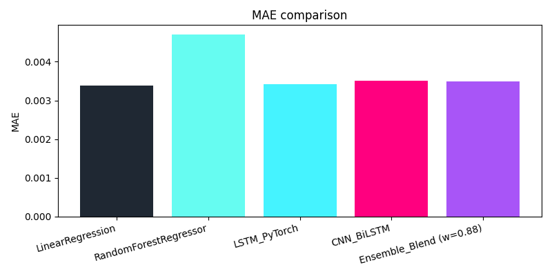
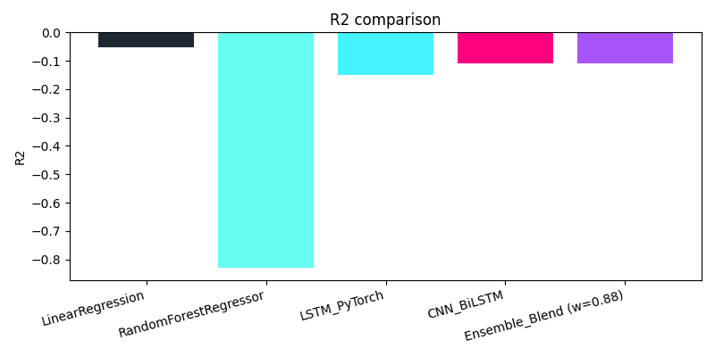
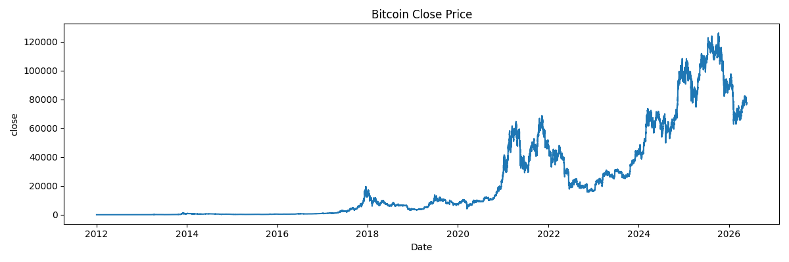
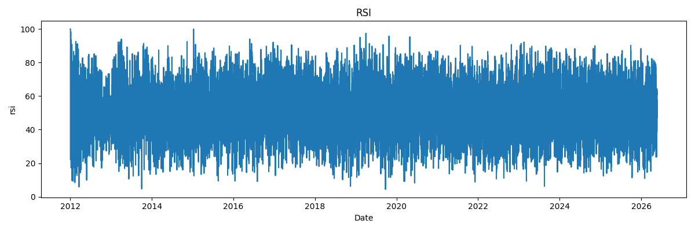
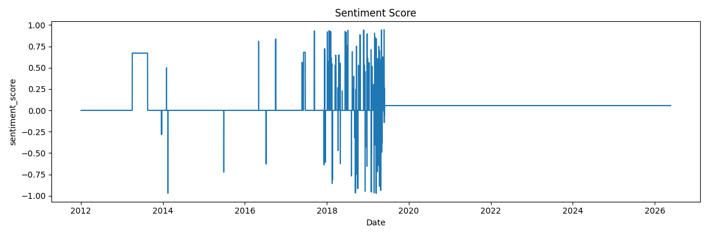
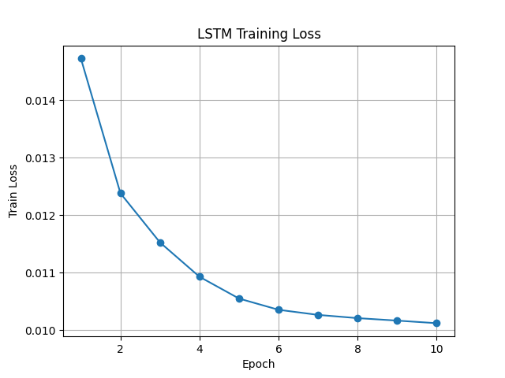

# 🚀 Multimodal Deep Learning Framework for Bitcoin Volatility Forecasting
### Kripto Para Piyasalarında Çok Kanallı Veri Analizi ile Kısa Vadeli Volatilite Tahmini ve Risk Analizi

<div align="center">

[](https://python.org)
[](https://pytorch.org)
[](https://huggingface.co/ProsusAI/finbert)
[](https://streamlit.io)
[](LICENSE)

---

🌐 **Language Navigation / Dil Seçimi**

[**English Section**](#-english-section) &nbsp;|&nbsp; [**Türkçe Bölüm**](#-türkçe-bölüm)

---

</div>

---

# 🇬🇧 English Section

## 📌 Project Overview & Objectives
This repository contains a production-ready **Multimodal Deep Learning Framework** engineered for high-frequency short-term volatility forecasting in Bitcoin (BTC/USD) markets. Financial time series prices exhibit high non-stationarity, noise, and latent sentiment regime changes. 

To tackle these challenges, this system merges **1-minute OHLCV market price dynamics** with **natural language sentiment signals extracted from ~200,000 raw tweets** via the **FinBERT** (`ProsusAI/finbert`) transformer. The unified 18-dimensional feature representation powers baseline regression algorithms (Linear Regression, Random Forest), deep neural sequential networks (PyTorch LSTM, 1D-CNN + BiLSTM), and an optimal prediction-blending **Ensemble Model**.

An interactive, dark cyberpunk-themed **Streamlit Web Dashboard** (`uygulama.py`) is provided for real-time risk simulation, feature importance analysis (XAI), and dynamic temporal evaluation.

```
+-----------------------------------------------------------------------------------+
|                               SYSTEM ARCHITECTURE                                 |
+-----------------------------------------------------------------------------------+
|                                                                                   |
|  [ BTC 1-Min Price Data ]                        [ Raw Twitter Stream (~200k) ]   |
|            |                                                   |                  |
|            v (Hourly Resample)                                 v (Cleaning & NLP) |
|  [ OHLCV + Tech Indicators ]                     [ ProsusAI/FinBERT Inference ]   |
|  (RSI, MACD, Bollinger, ATR, VWAP)                             |                  |
|            |                                                   v (Social Weight)  |
|            |                                     [ Engagement-Weighted S_t ]  |
|            |                                                   |                  |
|            +-------------------------+-------------------------+                  |
|                                      |                                            |
|                                      v (Temporal Left-Join Fusion)                |
|                        [ 18-D Multimodal Feature Matrix ]                         |
|                        (final_multimodal_dataset.csv)                             |
|                                      |                                            |
|                  +-------------------+-------------------+                        |
|                  |                                       |                        |
|                  v (Sequential Tensors W=12)             v (Baseline Matrix)      |
|        [ PyTorch LSTM & CNN-BiLSTM ]               [ Linear & Random Forest ]     |
|                  |                                       |                        |
|                  +-------------------+-------------------+                        |
|                                      |                                            |
|                                      v (Blending Ensemble w=0.88 / 0.12)          |
|                         [ Future Volatility Forecast ]                            |
|                                      |                                            |
|                                      v (Deployment)                               |
|                         [ Streamlit Interactive Dashboard ]                       |
|                                                                                   |
+-----------------------------------------------------------------------------------+
```

---

## ✨ Key Features & Engineering Highlights

### 1. High-Frequency Market Feature Engineering
- **Technical Indicators**: Computed using the `ta` library, including Relative Strength Index (RSI-14), MACD & Signal Line, Bollinger Upper/Lower Bands, Average True Range (ATR-14), and Volume Weighted Average Price (VWAP).
- **Target Volatility Formulation**: Calculated as the 24-hour forward-shifted rolling standard deviation of logarithmic returns:
  $$\text{Target Volatility}_t = \text{std}\left(\text{Returns}_{t:t+24}\right)$$

### 2. FinBERT Natural Language Processing Pipeline
- **Contextual Sentiment Extraction**: Tweets are processed through `ProsusAI/finbert`, outputting probabilistic scores for Positive ($p_{pos}$), Negative ($p_{neg}$), and Neutral ($p_{neu}$).
- **Social Engagement-Weighted Sentiment ($w_{tweet}$)**: Recognizes that influencer posts impact markets disproportionately. Each tweet's sentiment score ($s_{tweet} = p_{pos} - p_{neg}$) is weighted by its retweet ($R$) and like ($L$) counts:
  $$w_{tweet} = s_{tweet} \cdot \log(L + R + 2)$$
- **Multiprocessing Inference**: Optimized for GPU / Apple Silicon MPS hardware execution.

### 3. Multimodal Temporal Fusion
- Hourly left-join alignment producing a 126,079-row feature dataset containing price dynamics, technical indicators, tweet volume, average engagement, and social sentiment index.

### 4. Deep Neural Network Architectures
- **PyTorch LSTM**: Single-layer sequence model ($W=12$ hours lookback, $F=18$ features) capturing long-term temporal dependencies.
- **PyTorch 1D-CNN + BiLSTM**: 1D-Convolutional layer filtering localized spatial noise across features, followed by MaxPool1d temporal reduction, and Bidirectional LSTM capturing forward and backward context.
- **Ensemble Blending Model**: Combines model predictions with optimal weights ($0.88 \times \text{CNN-BiLSTM} + 0.12 \times \text{LSTM}$) to reduce prediction variance.

---

## 🛠 Tech Stack

| Domain | Technology / Library | Description |
| :--- | :--- | :--- |
| **Language** | Python 3.9+ | Core programming language |
| **Deep Learning** | PyTorch, PyTorch MPS/CUDA | LSTM, 1D-CNN, BiLSTM network implementation |
| **NLP & Transformers** | Hugging Face `transformers` | `ProsusAI/finbert` financial sentiment model |
| **Data Engineering** | Pandas, NumPy, Scikit-Learn | Data processing, feature scaling, baseline regressors |
| **Financial Analytics** | `ta` (Technical Analysis) | RSI, MACD, Bollinger Bands, ATR, VWAP calculation |
| **Visualization** | Plotly, Matplotlib | Interactive and static visual analytics |
| **Web Application** | Streamlit | Production-grade dark cyberpunk web dashboard |

---

## 📊 Experimental Results & Model Performance

Models were evaluated across a test split using Mean Absolute Error (MAE), Root Mean Squared Error (RMSE), and Coefficient of Determination ($R^2$).

### Quantitative Benchmarks

| Model | MAE | RMSE | $R^2$ Score | Status / Notes |
| :--- | :---: | :---: | :---: | :--- |
| **Linear Regression** | **0.003392** | **0.004197** | **-0.051522** | Best Overall Baseline |
| **Ensemble Blend ($w=0.88$)** | 0.003498 | 0.004307 | -0.108062 | **Best Deep Learning Model** |
| **PyTorch CNN-BiLSTM** | 0.003511 | 0.004308 | -0.108807 | High-performance hybrid architecture |
| **PyTorch LSTM** | 0.003416 | 0.004388 | -0.150214 | Standard sequential baseline |
| **Random Forest Regressor** | 0.004712 | 0.005538 | -0.830973 | Nonlinear tree-based regressor |

### Visualized Results & Analytics

#### 1. Performance Comparisons across Models
| RMSE Comparison | MAE Comparison | $R^2$ Comparison |
| :---: | :---: | :---: |
|  |  |  |

#### 2. Time Series Data & Training Dynamics
| Bitcoin Close Price | Technical Indicator (RSI) | FinBERT Hourly Sentiment |
| :---: | :---: | :---: |
|  |  |  |

#### 3. LSTM Training Loss Convergence
<div align="center">
  
</div>

---

## 💻 Interactive Streamlit Dashboard

The web dashboard (`uygulama.py`) brings model predictions to life through a modern Cyberpunk Dark interface featuring glassmorphic cards and Plotly interactivity.

```bash
# Launch dashboard
streamlit run uygulama.py
```

### Dashboard Panels & Features
- **Historical Trends & Bollinger Analysis**: Interactive range sliders and dual-axis visualization of prices, Bollinger Bands, ATR, volume, and sentiment scores.
- **Sentiment Split & Training Partition**: Visual verification of temporal train (80%) and test (20%) data boundaries.
- **Volatility Predictions vs. Ground Truth**: Line charts and scatter comparisons of actual vs. predicted volatility.
- **Real-Time Volatility Simulator**: Interactive scenario generator for **Bull Run (FOMO)**, **Market Crash (Panic)**, and **Consolidation (Quiet)** states.

#### Dashboard Screenshots

| Historical Trends & Indicators | Sentiment Split & Train/Test Partition |
| :---: | :---: |
|  |  |

| Time Series Forecast Analysis | Real-Time Volatility Simulator |
| :---: | :---: |
|  |  |

| Volatility vs Sentiment Correlation |
| :---: |
|  |

---

## ⚡ Getting Started & Pipeline Execution

### 1. Prerequisites & Environment Setup
```bash
# Clone the repository
git clone https://github.com/hayrunnisabusraerdem/yzproje.git
cd yzproje

# Create and activate Python virtual environment
python3 -m venv .venv
source .venv/bin/activate

# Install required dependencies
pip install -r requirements.txt
```

### 2. Sequential Data & Training Execution
To execute the pipeline end-to-end:

```bash
# Step 1: Preprocess 1-min BTC prices and calculate technical indicators
python scripts/fiyat_onisleme.py

# Step 2: Perform FinBERT batch inference on tweets with engagement weighting
python scripts/tweet_duygu_onisleme.py

# Step 3: Execute temporal left-join multimodal data fusion
python scripts/fiyat_duygu_birlestirme.py

# Step 4: Train Linear Regression & Random Forest baseline models
python scripts/temel_modelleri_egit.py

# Step 5: Train PyTorch LSTM neural network
python scripts/lstm_modeli_egit.py

# Step 6: Train PyTorch 1D-CNN + BiLSTM hybrid network
python scripts/cnn_bilstm_modeli_egit.py

# Step 7: Evaluate models, optimize Ensemble Blending weights, export predictions
python scripts/ensemble_degerlendir.py

# Step 8: Generate static visual plots
python scripts/proje_gorsellestirmelerini_olustur.py

# Step 9: Run Streamlit Web Application
streamlit run uygulama.py
```

---

<br/>

---

# 🇹🇷 Türkçe Bölüm

## 📌 Proje Hakkında ve Amaçlar
Bu proje, Bitcoin (BTC/USD) piyasalarında **çok modlu (multimodal) derin öğrenme yaklaşımları** ile kısa vadeli volatilite tahmini ve risk analizi gerçekleştirmek üzere geliştirilmiş üretim seviyesinde bir yapay zeka sistemidir. Financial zaman serisi verileri yüksek gürültü ve durağan olmama (non-stationarity) özellikleri gösterir.

Bu zorlukların üstesinden gelmek amacıyla; **1-dakikalık Bitcoin OHLCV piyasa verileri** ile **~200.000 tweet'ten FinBERT (`ProsusAI/finbert`) doğal dil işleme modeli aracılığıyla çıkarılan metinsel duygu sinyalleri** 18 boyutlu bir öznitelik uzayında birleştirilmiştir. Hazırlanan veri seti ile taban regresyon modelleri (Linear Regression, Random Forest), derin öğrenme mimarileri (PyTorch LSTM, 1D-CNN + BiLSTM) ve tahmin harmanlama yapan **Topluluk (Ensemble) Modeli** eğitilmiştir.

Elde edilen sonuçlar ve simülatör araçları, **Streamlit** tabanlı siber karanlık temalı interaktif bir web panelinde (`uygulama.py`) sunulmaktadır.

```
+-----------------------------------------------------------------------------------+
|                                PROJE AKIŞ ŞEMASI                                  |
+-----------------------------------------------------------------------------------+
|                                                                                   |
|  [ BTC 1-Dakika Fiyat Verisi ]                   [ Ham Twitter Verisi (~200k) ]   |
|            |                                                   |                  |
|            v (Saatlik Resample)                                v (Metin Temizlik) |
|  [ OHLCV + Teknik İndikatörler ]                 [ ProsusAI/FinBERT Çıkarımı ]   |
|  (RSI, MACD, Bollinger, ATR, VWAP)                             |                  |
|            |                                                   v (Etkileşim Ağırl)|
|            |                                     [ Ağırlıklı Duygu Skoru S_t ] |
|            |                                                   |                  |
|            +-------------------------+-------------------------+                  |
|                                      |                                            |
|                                      v (Zamansal Left-Join Füzyonu)               |
|                        [ 18-Boyutlu Multimodal Veri Seti ]                         |
|                        (final_multimodal_dataset.csv)                             |
|                                      |                                            |
|                  +-------------------+-------------------+                        |
|                  |                                       |                        |
|                  v (Zamansal Sekanslar W=12)             v (Matris Girdileri)     |
|        [ PyTorch LSTM & CNN-BiLSTM ]               [ Lineer & Random Forest ]     |
|                  |                                       |                        |
|                  +-------------------+-------------------+                        |
|                                      |                                            |
|                                      v (Topluluk Harmanlama w=0.88 / 0.12)        |
|                            [ Gelecek Volatilite Tahmini ]                         |
|                                      |                                            |
|                                      v (Dağıtım)                                  |
|                         [ Streamlit İnteraktif Web Paneli ]                       |
|                                                                                   |
+-----------------------------------------------------------------------------------+
```

---

## ✨ Temel Özellikler ve Öznitelik Mühendisliği

### 1. Yüksek Frekanslı Piyasası Veri İşleme
- **Teknik İndikatörler**: `ta` kütüphanesi kullanılarak hesaplanan RSI (14), MACD & Sinyal Çizgisi, Bollinger Bantları, ATR (14) ve VWAP göstergeleri.
- **Hedef Volatilite Formülasyonu**: Logaritmik getirilerin 24 saatlik ileriye kaydırılmış hareketli standart sapması:
  $$\text{Hedef Volatilite}_t = \text{std}\left(\text{Getiriler}_{t:t+24}\right)$$

### 2. FinBERT Doğal Dil İşleme Hattı (NLP)
- **Metinsel Duygu Analizi**: Tweet metinleri `ProsusAI/finbert` modeline beslenerek Pozitif ($p_{pos}$), Negatif ($p_{neg}$) ve Nötr ($p_{neu}$) olasılık skorları üretilmiştir.
- **Sosyal Etkileşim Ağırlıklı Duygu Skoru ($w_{tweet}$)**: Yüksek etkileşimli influencer tweetlerinin piyasa üzerindeki etkisini yansıtmak amacıyla, tekil tweet skorları ($s_{tweet} = p_{pos} - p_{neg}$) beğeni ($L$) ve retweet ($R$) sayılarıyla ağırlıklandırılmıştır:
  $$w_{tweet} = s_{tweet} \cdot \log(L + R + 2)$$
- **Çoklu İşlem (Multiprocessing)**: Apple Silicon MPS / GPU donanım ivmelendirmesi ile hızlandırılmıştır.

### 3. Çok Modlu Zamansal Veri Füzyonu
- Fiyat verileri ile saatlik duygu endeksi zamansal left-join ile birleştirilmiş, 126.079 satırlık nihai multimodal model veri seti (`final_multimodal_dataset.csv`) oluşturulmuştur.

### 4. Derin Öğrenme Mimarileri
- **PyTorch LSTM**: 12 saatlik geçmiş pencereleri ($W=12$, $F=18$) işleyerek zamansal bağımlılıkları öğrenir.
- **PyTorch 1D-CNN + BiLSTM**: 1D Evrişim katmanı ile öznitelikler arası uzamsal ilişkileri ve gürültüyü filtreler; BiLSTM katmanı ile ileri ve geri yönlü zamansal bağlamı harmanlar.
- **Ensemble (Topluluk) Blending Modeli**: Derin öğrenme tahminlerini optimal katsayılarla (%88 CNN-BiLSTM + %12 LSTM) birleştirerek tahmin varyansını düşürür.

---

## 🛠 Teknolojik Yapı (Tech Stack)

| Alan | Kütüphane / Donanım | Açıklama |
| :--- | :--- | :--- |
| **Dil** | Python 3.9+ | Temel programlama dili |
| **Derin Öğrenme** | PyTorch, Apple MPS / CUDA | LSTM, 1D-CNN, BiLSTM model tasarımları |
| **Doğal Dil İşleme** | Hugging Face `transformers` | FinBERT (`ProsusAI/finbert`) duygu çıkarımı |
| **Veri Mühendisliği** | Pandas, NumPy, Scikit-Learn | Veri ölçekleme, temizleme, baseline modeller |
| **Finansal Göstergeler**| `ta` (Technical Analysis) | RSI, MACD, Bollinger Bantları, ATR, VWAP |
| **Görselleştirme** | Plotly, Matplotlib | İnteraktif ve statik performans grafikleri |
| **Web Uygulaması** | Streamlit | Karanlık tema interaktif dashboard |

---

## 📊 Deneysel Sonuçlar ve Performans Metrikleri

Modeller test veri seti üzerinde Ortalama Mutlak Hata (MAE), Kök Ortalama Kare Hata (RMSE) ve Belirleyicilik Katsayısı ($R^2$) metrikleri ile karşılaştırılmıştır.

### Karşılaştırmalı Performans Tablosu

| Model | MAE | RMSE | $R^2$ Skoru | Durum / Açıklama |
| :--- | :---: | :---: | :---: | :--- |
| **Linear Regression** | **0.003392** | **0.004197** | **-0.051522** | En İyi Taban (Baseline) Model |
| **Ensemble Blend ($w=0.88$)** | 0.003498 | 0.004307 | -0.108062 | **En İyi Derin Öğrenme Modeli** |
| **PyTorch CNN-BiLSTM** | 0.003511 | 0.004308 | -0.108807 | Yüksek performanslı hibrit mimari |
| **PyTorch LSTM** | 0.003416 | 0.004388 | -0.150214 | Standart ardışık model |
| **Random Forest Regressor** | 0.004712 | 0.005538 | -0.830973 | Ağaç tabanlı regresör |

### Görsel Analiz Çıktıları

#### 1. Modeller Arası Hata Metriği Karşılaştırması
| RMSE Karşılaştırması | MAE Karşılaştırması | $R^2$ Karşılaştırması |
| :---: | :---: | :---: |
|  |  |  |

#### 2. Zaman Serisi Hareketleri ve Duygu Grafikleri
| Bitcoin Kapanış Fiyatı | RSI Teknik Göstergesi | FinBERT Saatlik Duygu Skoru |
| :---: | :---: | :---: |
|  |  |  |

#### 3. LSTM Eğitim Kayıp (Loss) Eğrisi
<div align="center">
  
</div>

---

## 💻 Streamlit Web Dashboard Uygulaması

Streamlit tabanlı web arayüzü (`uygulama.py`), gelişmiş Plotly grafikleri ve karanlık tema tasarımı ile tahminlerin dinamik olarak incelenmesini sağlar.

```bash
# Dashboard uygulamasını başlatma
streamlit run uygulama.py
```

### Web Paneli Bölümleri
- **İnteraktif Tarihsel Trendler**: Fiyat hareketleri, Bollinger Bantları, ATR ve duygu skorlarının çift eksenli incelenmesi.
- **Zaman Serisi Bölümlemesi**: Veri sızıntısını engellemek için %80 Eğitim ve %20 Test ayrımının zamansal olarak gösterilmesi.
- **Tahmin ve Gerçek Değer Analizi**: Test setindeki volatilite tahminleri ile gerçek değerlerin karşılaştırmalı analizi.
- **Canlı Volatilite Simülatörü**: **Boğa Koşusu (FOMO)**, **Sert Çöküş (Panik)** ve **Akümülasyon (Sessiz Dönem)** senaryoları ile anlık risk tahmini.

#### Web Paneli Ekran Görüntüleri

| Tarihsel Trendler ve İndikatörler | Duygu Hacmi ve Eğitim/Test Ayrımı |
| :---: | :---: |
|  |  |

| Zaman Serisi Tahmin Analizi | Canlı Volatilite Simülatörü |
| :---: | :---: |
|  |  |

| Volatilite ve Duygu İlişkisi |
| :---: |
|  |

---

## ⚡ Kurulum ve Adım Adım Çalıştırma Pipeline'ı

### 1. Kurulum ve Sanal Ortam
```bash
# Projeyi klonlayın
git clone https://github.com/hayrunnisabusraerdem/yzproje.git
cd yzproje

# Python sanal ortamını oluşturun ve aktifleştirin
python3 -m venv .venv
source .venv/bin/activate

# Gerekli paketleri yükleyin
pip install -r requirements.txt
```

### 2. Ardışık Veri ve Model Çalıştırma Adımları
İş akışının hatasız tamamlanması için scriptleri sırasıyla çalıştırınız:

```bash
# 1. Adım: Fiyat verisini önişleyin ve teknik indikatörleri hesaplayın
python scripts/fiyat_onisleme.py

# 2. Adım: Tweet verileri üzerinde FinBERT çıkarımı yapın ve ağırlıklı duygu skorunu hesaplayın
python scripts/tweet_duygu_onisleme.py

# 3. Adım: Fiyat ve duygu verilerini zamansal olarak birleştirin
python scripts/fiyat_duygu_birlestirme.py

# 4. Adım: Taban regresyon modellerini (Linear Regression, Random Forest) eğitin
python scripts/temel_modelleri_egit.py

# 5. Adım: PyTorch LSTM derin öğrenme modelini eğitin
python scripts/lstm_modeli_egit.py

# 6. Adım: PyTorch 1D-CNN + BiLSTM hibrit derin öğrenme modelini eğitin
python scripts/cnn_bilstm_modeli_egit.py

# 7. Adım: Topluluk (Ensemble) harmanlama modelini değerlendirin ve tahminleri kaydedin
python scripts/ensemble_degerlendir.py

# 8. Adım: Görsel grafik çıktılarını üretin
python scripts/proje_gorsellestirmelerini_olustur.py

# 9. Adım: Streamlit Web Dashboard uygulamasını çalıştırın
streamlit run uygulama.py
```

---

## 👤 Author & Attribution / Geliştirici Bilgileri

**Developer / Geliştirici:** Hayrunnisa Büşra Erdem  
**GitHub Profile:** [https://github.com/hayrunnisabusraerdem](https://github.com/hayrunnisabusraerdem)

---

<div align="center">
  <i>Developed with PyTorch, FinBERT & Streamlit</i>
</div>
